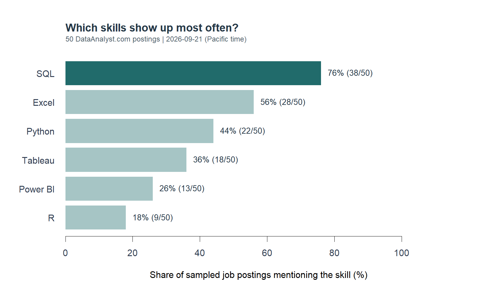

```{r}
counts <- read.csv("results/skill_counts.csv", check.names = FALSE)
metrics <- read.csv("results/metrics.csv")
jobs <- read.csv("data/jobs.csv")
number <- function(skill) counts$jobs[match(skill, counts$skill)]
percent <- function(skill) sprintf("%.0f%%", counts$percent[match(skill, counts$skill)])
metric <- function(name) metrics$value[match(name, metrics$metric)]
n <- nrow(jobs)
```

Learning data analysis comes with a long shopping list: Excel, SQL, Python, R, and several dashboard tools. Trying to learn all of them at once is a good way to finish none of them. If I had a few weeks to prepare for an analyst role, which skill would I work on first?

To make that choice less arbitrary, I used R's `rvest` package to collect `r n` job postings from [DataAnalyst.com](https://www.dataanalyst.com/job-experience/entry-level-data-analyst-jobs). I looked for six familiar tools and counted how often employers mentioned each one.

## A small, focused sample

The collection took place on September 21, 2026, Pacific time. I used the first page of the site's entry-level category, which labels roles as requiring zero to three years of experience. I kept active listings with "data analyst" in the title, excluded senior and leadership titles, removed duplicates, and took the first `r n` qualifying listings in the displayed order. The board's publication dates ran from May 14 to September 8, 2026.

For each job, `rvest` extracted the responsibilities and requirements. I left out company descriptions and related-job suggestions, since those could mention skills unrelated to the position. Each skill counted once per posting, even if it appeared several times. "PowerBI" and "Power BI" counted as the same tool. I also reviewed the matched text to check that words such as "Excel" referred to software.

The public pages needed no login, and the site's [robots.txt](https://www.dataanalyst.com/robots.txt) had no disallowed paths at collection. Requests were spaced at least three seconds apart, and the pages were saved locally so rerunning the analysis would not repeatedly contact the website.

## What showed up most often?

{fig-alt="Horizontal bar chart showing the share of 50 sampled data analyst postings mentioning SQL, Excel, Python, Tableau, Power BI, and R. Exact counts are provided in the table below."}

```{r}
#| label: tbl-skills
#| tbl-cap: "Mentions in responsibilities or requirements"
knitr::kable(data.frame(
  Skill = counts$skill,
  Postings = counts$jobs,
  Share = sprintf("%.0f%%", counts$percent)
), align = c("l", "r", "r"))
```

SQL appeared in `r number("SQL")` of the `r n` postings (`r percent("SQL")`). That makes it the clearest starting point among the six tools I checked. Excel appeared in `r number("Excel")` postings, while Python appeared in `r number("Python")`. The gap matters when study time is limited: I would want to be comfortable working with tables before adding another language to my list.

The tools also overlap. `r metric("sql_and_python")` postings mentioned both SQL and Python, and `r metric("either_visualization")` mentioned at least one of Tableau or Power BI. These are useful combinations to practice, although a mention might describe a preferred skill or one of several acceptable tools. It does not always mean the employer requires it.

## How I would use this

I would start with a small SQL project: take a sales dataset, join the customer and order tables, and calculate monthly revenue. Then I would check the totals in Excel and write a short explanation of what changed. That gives me something concrete to discuss in an interview.

Once that feels manageable, I would choose the next tool from the jobs I actually want. For a role mentioning Python, I could automate the same cleaning steps. For a dashboard role, I could turn the results into a simple Tableau or Power BI report. There is little reason to learn both dashboard tools immediately just because they appear on a general skills list.

This sample has limits. It comes from one board, includes older listings, and contains `r metric("remote")` remote roles. Its entry-level label may also be imperfect. Keyword counts measure mentions, not proficiency or the effect of a skill on getting hired. A low count for R here does not make it unhelpful in research or economics.

For this sample, my first investment would be SQL, supported by Excel practice. After that, I would use a shortlist of actual target jobs to decide what to learn next.

## Data and code

The [GitHub project folder](https://github.com/Devinshen123/devinshen123-website/tree/main/blog/posts/post2) contains the saved pages, cleaned data, results, and a README with replication instructions. Download the [job data](data/jobs.csv) or [skill counts](results/skill_counts.csv). The code below uses `rvest` for extraction and base R for counting and plotting. See the [rvest documentation](https://rvest.tidyverse.org/reference/read_html.html) for the scraping functions.

::: {.callout-note collapse="true" title="R code: collect and clean the postings"}
```{r}
#| results: asis
cat("```r\n", paste(readLines("code/scrape.R"), collapse = "\n"), "\n```\n", sep = "")
```
:::

::: {.callout-note collapse="true" title="R code: count skills and create the chart"}
```{r}
#| results: asis
cat("```r\n", paste(readLines("code/analyze.R"), collapse = "\n"), "\n```\n", sep = "")
```
:::
