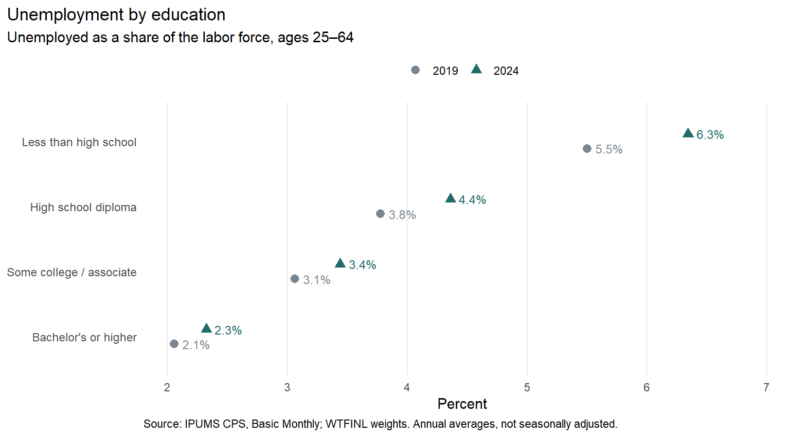
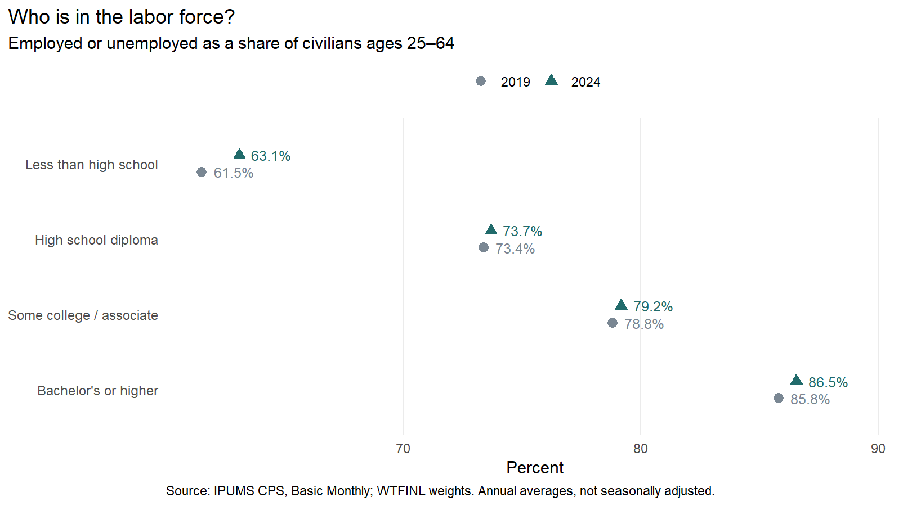
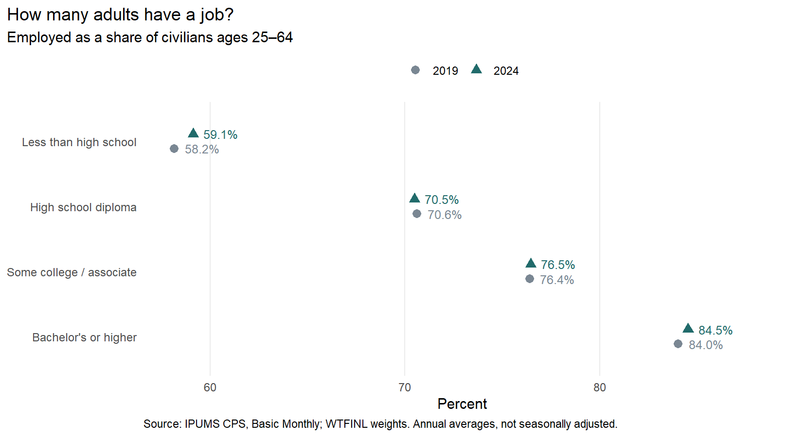

```{r}
rates <- read.csv("results/annual_rates.csv")
value <- function(year, education, measure) {
  rates[rates$YEAR == year & rates$education == education, measure]
}
less <- "Less than high school"
college <- "Bachelor's or higher"
pct <- function(year, education, measure) {
  sprintf("%.1f%%", value(year, education, measure))
}
gap <- function(year, measure) {
  sprintf("%.1f", value(year, college, measure) - value(year, less, measure))
}
```

When I think about whether education helps people find work, the unemployment rate seems like a reasonable place to start. But it leaves out people who are neither working nor looking for a job. That can make a big difference to the picture.

I used IPUMS CPS data to ask: **How do employment outcomes differ by education, and did those gaps change between 2019 and 2024?** Looking at unemployment, labor-force participation, and employment together gives a fuller answer.

## The data and the weights

I combined all twelve Basic Monthly CPS samples in each year and focused on civilian adults ages 25 to 64 living outside institutions. This avoids much of the schooling and retirement that shape employment at younger and older ages. I grouped people into four education levels, from less than high school to a bachelor's degree or higher.

Each observation received its [WTFINL sampling weight](https://cps.ipums.org/cps-action/variables/WTFINL). A person in the sample represents many people in the population, so counting everyone equally would give the wrong comparison. I averaged the twelve monthly weighted population totals, then calculated the annual rates from those totals. The figures are not seasonally adjusted.

## Unemployment is lower with more education

{fig-alt="Paired points show unemployment increasing between 2019 and 2024 in all four education groups. In 2024, rates range from 2.3 percent for bachelor's or higher to 6.3 percent for less than high school."}

In 2024, the unemployment rate was `r pct(2024, college, "unemployment_rate")` for adults with at least a bachelor's degree, compared with `r pct(2024, less, "unemployment_rate")` for those without a high school diploma. The two middle groups fell between them. The same ordering appeared in 2019.

Unemployment was a little higher in every group in 2024. For adults without a high school diploma, it rose from `r pct(2019, less, "unemployment_rate")` to `r pct(2024, less, "unemployment_rate")`. Still, the gaps across education levels were much larger than most of the changes over time.

## Who is missing from that comparison?

{fig-alt="Labor-force participation was slightly higher in 2024 in all four groups. In 2024 it was 63.1 percent for less than high school, 73.7 for high school, 79.2 for some college or associate, and 86.5 for bachelor's or higher."}

The unemployment rate only covers people in the labor force. Someone who stays home to care for family and is not seeking work is outside that denominator. The CPS also counts people on temporary layoff as unemployed, even when they are not actively searching.

Figure 2 adds the people outside the labor force. In 2024, participation was `r pct(2024, college, "participation_rate")` among college graduates and `r pct(2024, less, "participation_rate")` among adults without a high school diploma. That is a `r gap(2024, "participation_rate")` percentage-point gap. Participation rose slightly in all four groups between the two years, even though unemployment also rose.

## Putting the two pieces together

{fig-alt="Employment-to-population ratios in 2024 were 59.1 percent for less than high school, 70.5 for high school, 76.5 for some college or associate, and 84.5 for bachelor's or higher. Changes from 2019 were small."}

The employment-to-population ratio answers a direct question: out of all adults in a group, how many have a job? In 2024, about `r sprintf("%.0f", value(2024, college, "employment_ratio"))` out of 100 college graduates were employed, compared with `r sprintf("%.0f", value(2024, less, "employment_ratio"))` out of 100 adults without a high school diploma.

This figure combines the first two measures: the employment share equals participation multiplied by one minus the unemployment rate, with rates written as fractions. Higher participation can therefore offset higher unemployment. That helps explain why the employment share for adults without a high school diploma increased from `r pct(2019, less, "employment_ratio")` to `r pct(2024, less, "employment_ratio")`, despite their higher unemployment rate.

These are descriptive comparisons. Education groups differ in age, health, family responsibilities, and other characteristics, so the charts cannot show how much of the gap education itself causes. I also have not estimated confidence intervals; the small changes should not be read as statistically significant.

For me, the main takeaway is to check participation before judging the labor market from unemployment alone. The education gap in having a job remained large in both years, and much of it was connected to whether people were in the labor force at all. A discussion of employment support needs to consider barriers to participation as well as help with finding a job.

## Data and code

[GitHub repository and replication instructions](https://github.com/Devinshen123/devinshen123-website/tree/main/blog/posts/post3) · [Weighted results (CSV)](results/annual_rates.csv)

Data: Sarah Flood, Miriam King, Renae Rodgers, Steven Ruggles, J. Robert Warren, Daniel Backman, Etienne Breton, Grace Cooper, Julia A. Rivera Drew, Stephanie Richards, David Van Riper, and Kari C.W. Williams. *IPUMS CPS: Version 13.0* [dataset]. Minneapolis, MN: IPUMS, 2025. [doi:10.18128/D030.V13.0](https://doi.org/10.18128/D030.V13.0). Extracted September 28, 2026 (Pacific time).

Definitions: [EMPSTAT](https://cps.ipums.org/cps-action/variables/EMPSTAT) and [EDUC](https://cps.ipums.org/cps-action/variables/EDUC). Annual-average method: [CPS Technical Paper 66](https://cps.ipums.org/cps/resources/cpr/tp66.pdf), printed page 10–15.
