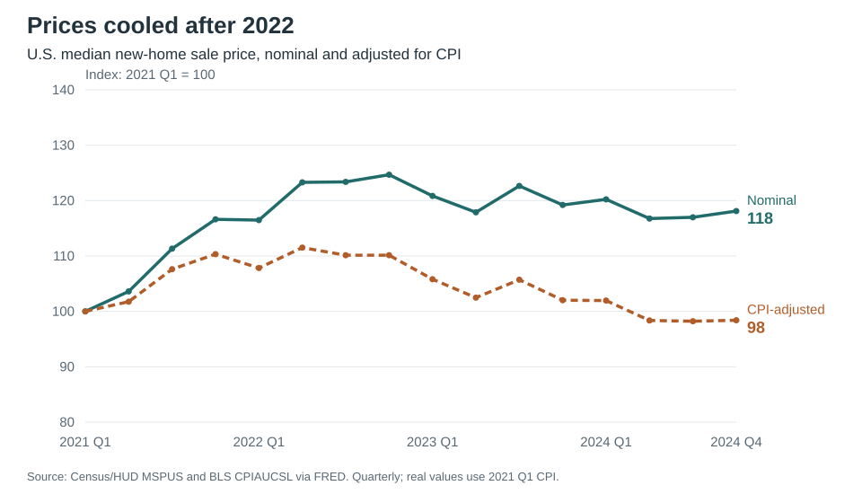
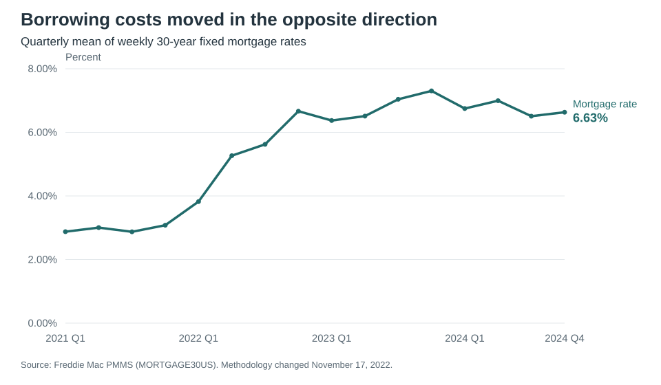
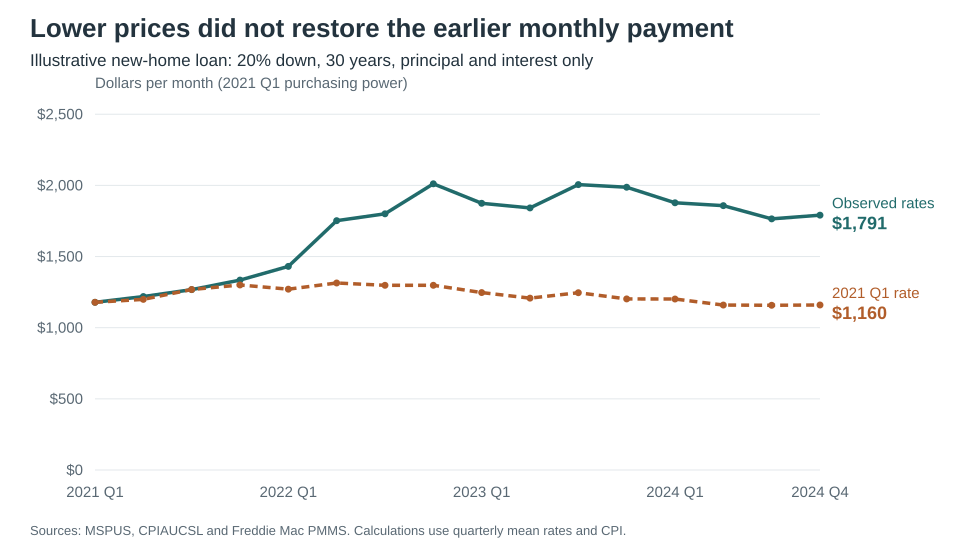

By the end of 2024, the median price of a new U.S. home was slightly lower than in early 2021 after accounting for inflation. Yet a buyer financing that home would face a monthly mortgage payment about 52% higher, also after inflation.

I asked whether falling new-home prices brought monthly mortgage payments back toward their early-2021 level. To answer that question, I compared sale prices, mortgage rates, and consumer prices from 2021 through 2024. Three charts show why the decline in sale prices brought only partial relief to someone taking out a new loan.

## Home prices gave back some of their gains

{fig-alt="Quarterly lines show nominal median new-home prices rising from an index of 100 in 2021 Q1 to 124.7 in 2022 Q4 and ending at 118.1 in 2024 Q4. The CPI-adjusted index ends at 98.4."}

The median new-home sale price climbed from $355,000 in early 2021 to $442,600 in late 2022. It ended 2024 at $419,300, down 5.3% from that peak.

That still looks expensive compared with 2021. But dollars bought less by 2024. Adjusting for consumer-price inflation puts the final price at about $349,310 in early-2021 dollars—1.6% below its starting point. The inflation-adjusted decline from late 2022 was 10.7%.

For a buyer paying cash, that comparison is encouraging. A buyer borrowing most of the purchase price faces another number.

## A new mortgage cost much more

{fig-alt="The average mortgage rate rises from 2.88 percent in 2021 Q1 to above 7 percent in late 2023 and ends at 6.63 percent in 2024 Q4."}

The average 30-year fixed mortgage rate was 2.88% in the first quarter of 2021. By the final quarter of 2024, it was 6.63%. Rates had eased from their late-2023 high, but borrowing was still considerably more expensive than at the start of the period.

A lower sale price reduces the loan balance. A higher rate raises the payment on every dollar borrowed. To see which change mattered more, I put them together.

## The monthly bill stayed high

{fig-alt="The payment calculated with observed quarterly rates starts at 1178 dollars, reaches about 2011 dollars in 2022 Q4, and ends at 1791 dollars in 2024 Q4. The constant-rate scenario ends at 1160 dollars."}

For each quarter, I calculated the payment on a median-priced new home with a 20% down payment and a 30-year fixed mortgage at that quarter's average rate. The chart shows principal and interest in early-2021 dollars.

The monthly payment rose from $1,178 in early 2021 to $2,011 in late 2022, then fell to $1,791 at the end of 2024. That was still about $612 more per month than at the start, in the same purchasing power. In actual late-2024 dollars, the payment was $2,149.

The dashed line asks a narrower question: what would the payment be at each quarter's price if the rate stayed at 2.88%? It ends at $1,160. The gap between the lines shows how much the interest rate changes the payment at the same price; it does not predict where house prices would have gone if rates had stayed low.

Falling prices did help. They just did not bring this new borrower's monthly payment close to its early-2021 level.

These figures cover new homes, whose median price can change when the mix of homes sold changes. They also leave out taxes, insurance, maintenance, fees, and income. This is a comparison of loan payments, not a complete measure of affordability. And an owner who already has a fixed-rate mortgage does not automatically face the higher rates shown here.

The distinction matters: a cheaper house can still come with a larger monthly bill.

## Data and code

Freddie Mac changed its mortgage-rate survey methodology on November 17, 2022, which complicates comparisons across that date. The published averages are not the rate every individual buyer would receive.

I averaged 208 weekly mortgage rates and 48 monthly CPI observations within their calendar quarters, then joined them to 16 quarterly sale prices. The code checks completeness, missing values, and duplicate dates. For a loan with 360 monthly payments,

$$
M = 0.8P\frac{i}{1-(1+i)^{-360}}, \qquad i=\frac{r}{100\times12},
$$

where $P$ is the sale price and $r$ is the annual rate in percent. Multiplying prices and payments by $\mathrm{CPI}_{2021\mathrm{Q1}}/\mathrm{CPI}_t$ expresses them in 2021 Q1 dollars. Calculations use unrounded rates.

[Quarterly calculations (CSV)](results/quarterly.csv) · [Replication instructions](https://github.com/Devinshen123/devinshen123-website/tree/main/blog/posts/post4) · [Analysis code](https://github.com/Devinshen123/devinshen123-website/blob/main/blog/posts/post4/code/analyze.mjs)

Sources, retrieved October 6, 2026:

- U.S. Census Bureau and U.S. Department of Housing and Urban Development. [Median Sales Price of New Houses Sold for the United States (MSPUS)](https://fred.stlouisfed.org/series/MSPUS), via FRED. Dollars, quarterly, not seasonally adjusted.
- Freddie Mac. [30-Year Fixed Rate Mortgage Average in the United States (MORTGAGE30US)](https://fred.stlouisfed.org/series/MORTGAGE30US), via FRED. Percent, weekly, not seasonally adjusted.
- U.S. Bureau of Labor Statistics. [Consumer Price Index for All Urban Consumers: All Items in U.S. City Average (CPIAUCSL)](https://fred.stlouisfed.org/series/CPIAUCSL), via FRED. Monthly, seasonally adjusted, 1982–1984 = 100.

The saved data were downloaded programmatically from FRED CSV URLs. Both the offline analysis and the `--refresh` download-and-analysis workflow were verified. Providers can revise historical data; the README documents the retrieval method and replication limits.
